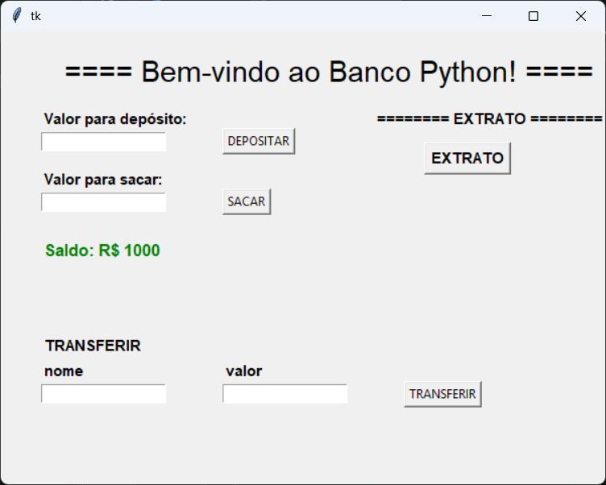

# 🏦 Banco Python

Sistema bancário desenvolvido em **Python** utilizando **Tkinter** para criação da interface gráfica.

O projeto simula operações básicas de um banco, permitindo realizar depósitos, saques, transferências e consultar o extrato das operações realizadas.

---

## 📸 Demonstração

### 🏦 Tela principal



---

## 🚀 Funcionalidades

- 💰 Realizar depósitos
- 💸 Realizar saques
- 🔄 Realizar transferências
- 📄 Consultar extrato
- 💵 Atualização automática do saldo
- ⚠️ Validação de valores
- 👤 Transferência para um destinatário
- 🖥️ Interface gráfica utilizando Tkinter

---

## 🛠️ Tecnologias utilizadas

- 🐍 **Python**
- 🖼️ **Tkinter**
- 🌱 **Git**
- 🐙 **GitHub**

---

## 📚 Conceitos praticados

Durante o desenvolvimento do projeto foram praticados conceitos fundamentais de Python:

- Variáveis
- Condicionais (`if / elif / else`)
- Funções
- Listas
- Loops (`for`)
- Strings
- F-strings
- Conversão de tipos
- Manipulação de `Entry` e `Label`
- Eventos e `command` no Tkinter
- Organização de uma interface gráfica

---

## 🎯 Objetivo

O objetivo deste projeto foi colocar em prática os conhecimentos adquiridos em **Python** e dar os primeiros passos no desenvolvimento de aplicações com **interfaces gráficas**.

Este projeto também servirá como base para uma futura versão web utilizando **HTML, CSS e JavaScript**.

---

## ▶️ Como executar

### 1. Clone o repositório

```bash
git clone https://github.com/velsoy/banco-python.git
